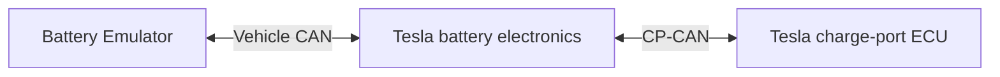

# DORA setup: confirmed topology and wiki review

The user confirmed the emulator connects only to the Tesla battery's Vehicle
CAN. The charge-port ECU connects directly to the battery on its separate
connection. L2 charging has worked in this arrangement. Do not ask the user to
identify these two connections again unless new evidence contradicts this record.

This is a connection diagram, not a claim that every frame crosses between buses.
The battery's internal forwarding and command processing are not yet mapped.

## Documentation reviewed

The complete [Tesla Model 3/Y battery page](https://dalathegreat.github.io/Battery-Emulator-Wiki/battery/tesla_model_3_y/)
was reviewed, including pack variants, configuration, precharge, low-voltage
supply, interlocks, penthouse components and balancing. Its X098 photo and
complete wiring diagram were inspected directly. The linked
[charger integration page](https://dalathegreat.github.io/Battery-Emulator-Wiki/setup/chargers/tesla_model_3/)
was reviewed as well.

The documented X098 assignments distinguish Vehicle CAN (16 high / 15 low)
from charge-port CAN (7 high / 6 low). The charger page connects those CP-CAN
pins to X096 at the charge-port ECU and separately identifies latch-enable and
fault lines. These are reference assignments, not a physical pin inspection of
DORA. The battery documentation also distinguishes the main HV contactors,
fast-charge contactor assembly and PCS low-voltage output.

The wiki emphasizes matching configuration to the donor pack and describes
manually configured inverter power limits. DORA's displayed 9 kW limits therefore
must not be treated as proof that the BMS permits a DC charging session.

The charger page labels its integration unfinished and states its Vehicle-CAN
forwarding expectation as an assumption. The separate battery compatibility list
does not establish third-party CCS/NACS DC charging support.

The two linked installation PDFs could not be fetched by the web reader (expired
attachment redirects); they are not claimed as reviewed. Tesla's linked official
electrical-reference index was read, but the interactive SOP4 circuit content
and specific connector pages were not accessible through that reader. A pack
manufacture date alone would not establish the charge-port ECU revision anyway.

## Effect on the investigation

- DORA's saved emulator captures are on Vehicle CAN. The comparison CCS capture
  is on CP-CAN. Message-count and presence differences across those recordings
  cannot be treated as a list of messages the charge port lacks.
- Charge-port-origin status/alerts are visible in DORA's Vehicle-CAN recording,
  and disappeared when the charge-port ECU was powered off. This supports an
  existing path for at least some CP information. It does not establish the
  reverse direction for each emulator command.
- Successful L2 charging is evidence that the existing arrangement supports an
  AC charging path. It argues against declaring the layout wrong merely because
  the emulator is not directly attached to CP-CAN.
- The useful question is which DC configuration/commands the battery processes
  or forwards and which the CP ECU accepts. A passive CP-side measurement can
  distinguish these cases; it is not a proposed permanent wiring change.
- First resolve and expose the previously demonstrated stale stop/release state
  in offline software work. Preserve the working AC and inverter behavior. A
  clean start is required before judging additional DC communication changes.

No firmware, configuration, contactor or CAN controls were changed in this review.
